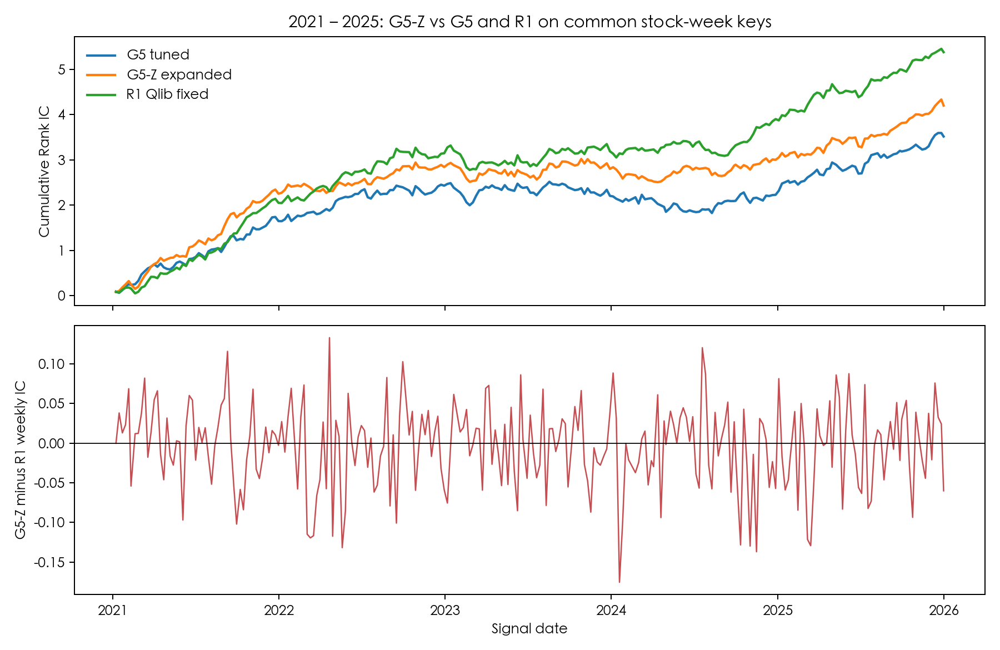
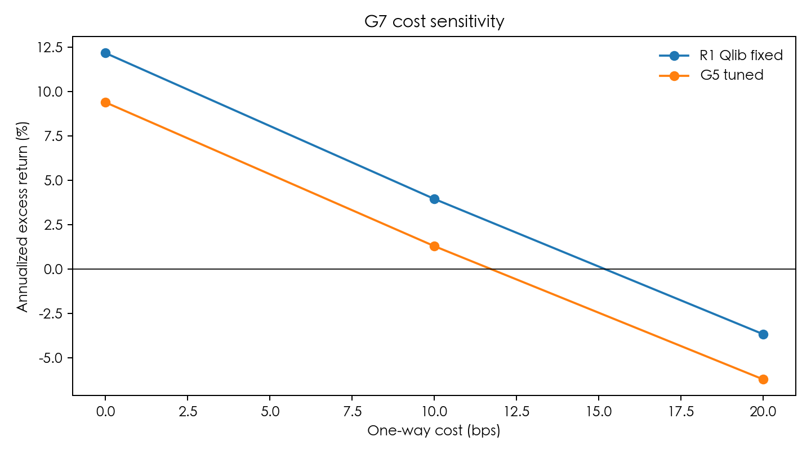

# CSI 300 Alpha158 Weekly Experiment

## Scope

This experiment asks whether Microsoft Qlib Alpha158 features can rank the
following week's excess returns across the point-in-time CSI 300 universe, and
whether non-linear models add reliable value after neutralization and
transaction-aware diagnostics. It is a fixed research protocol, not a model
search or trading system.

The universe is reconstructed as point-in-time effective CSI 300 membership
intervals. Current constituents must never be backfilled into historical
dates. A security requires 61 valid daily observations before a signal date,
because the largest Alpha158 lookback uses `Ref(x, 60)`.

Signals are formed after the close on the last trading day of each week.
Positions enter at the next trading day's adjusted open and exit at the first
open after the following weekly signal. The target is that stock's adjusted
open-to-open return less the contemporaneous CSI 300 adjusted open-to-open
return. Features use information available no later than the signal close.

## Feature and validation design

The feature library is the 158-column Qlib Alpha158 definition pinned in
`config/research_v1.json`. The local engine passed a numerical parity check on
10 securities and 20 signal dates: missing-value patterns matched and finite
values were within an absolute tolerance of `1e-6`. This is a limited
implementation check, not a claim that the data, sample, or investment results
replicate every Qlib benchmark.

Each signal-date cross section replaces infinities with missing values, fills
with the median, applies median/MAD winsorization, and uses a `ddof=0`
Z-score. Scores are residualized by contemporaneous log market capitalization
and SW2021 level-1 industry dummies; this is score neutralization, not a full
Barra risk model.

Five rolling folds use five training years, one validation year, and one test
year, producing 2021–2025 out-of-sample tests. A split is purged by
`label_end_date`: training or validation observations must finish strictly
before the next segment begins. Ridge and LightGBM use the same panel, folds,
and locked test periods. G5-Z is an expanded local LightGBM tuning comparison;
R1 transfers the published Qlib-style LightGBM parameterization with the
specified label-scale treatment.

## Locked result summary

On the common 2021–2025 out-of-sample panel, the neutralized mean weekly Rank
IC values were G5 **0.0137**, G5-Z **0.0164**, and R1 **0.0210**. These are
descriptive averages, not declarations of a winning model. Prespecified
paired weekly HAC tests found G5-Z minus G5 = 0.00267 (`t=0.78`, two-sided
`p=0.438`) and G5-Z minus R1 = -0.00461 (`t=-1.41`, `p=0.158`). Neither
comparison is significant at the 5% two-sided threshold.

Rank IC is calculated cross-sectionally each week using Spearman ranks. The
mean series and paired differences use a Bartlett Newey–West HAC estimate with
four lags. This treatment acknowledges weekly serial dependence; it does not
turn a non-significant comparison into proof of superiority.

## Top-50 trading diagnostic

The trading diagnostic holds the Top 50 neutralized scores at equal weights,
rebalanced weekly at the next open. Suspended names cannot be bought or sold,
limit-up names cannot be bought, limit-down names cannot be sold, failed sells
remain in the portfolio, and costs apply only to actual traded notional. Cost
scenarios are 0, 10, and 20 bps per side.

The diagnostic should not be read as a live strategy. In the recorded R1
run, 10 bps per side produced 3.95% annualized excess return and 0.56 IR, but
cumulative turnover was approximately 311.7 times initial capital and the
20 bps annualized excess return was -3.66%. Turnover, execution assumptions,
data revisions, and capacity can materially change realized results.

## Private data contract

No data or derived run artifacts are included. Before invoking a model runner,
set `A_SHARE_DATA_ROOT` to an existing private directory. The expected private
input and output layout is recorded in
[`config/data_root.example`](config/data_root.example). The runners reject a
missing or nonexistent root before loading inputs or fitting a model.

The public code assumes the researcher supplies lawfully obtained data and
recreates the point-in-time membership, labels, and fold assignments under the
frozen protocol. Results may not reproduce with a different vendor, revision,
calendar, universe reconstruction, or execution model.

For the complete method and known limitations, read
[`docs/research_protocol.md`](docs/research_protocol.md).
